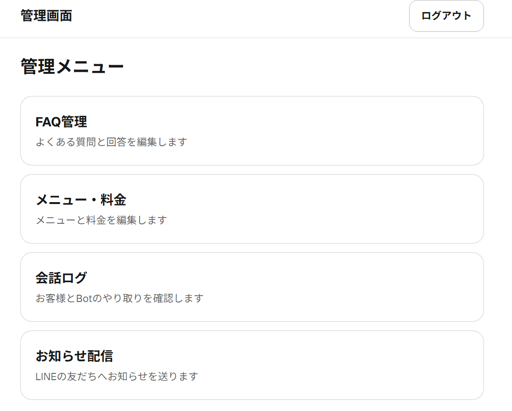
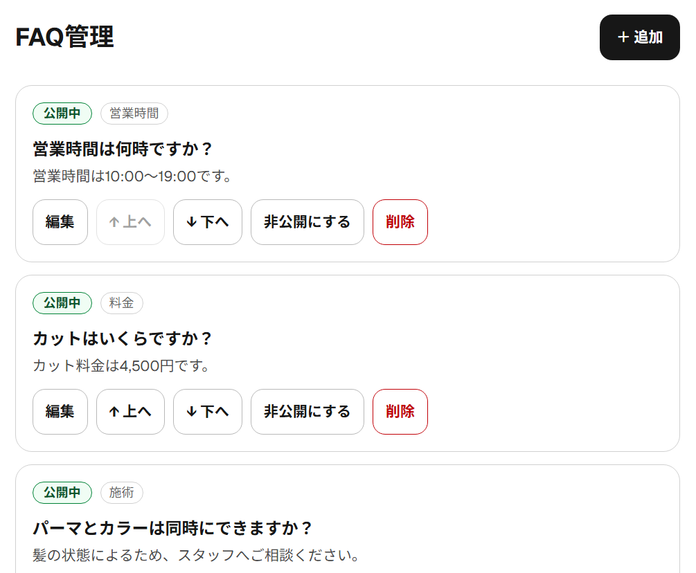
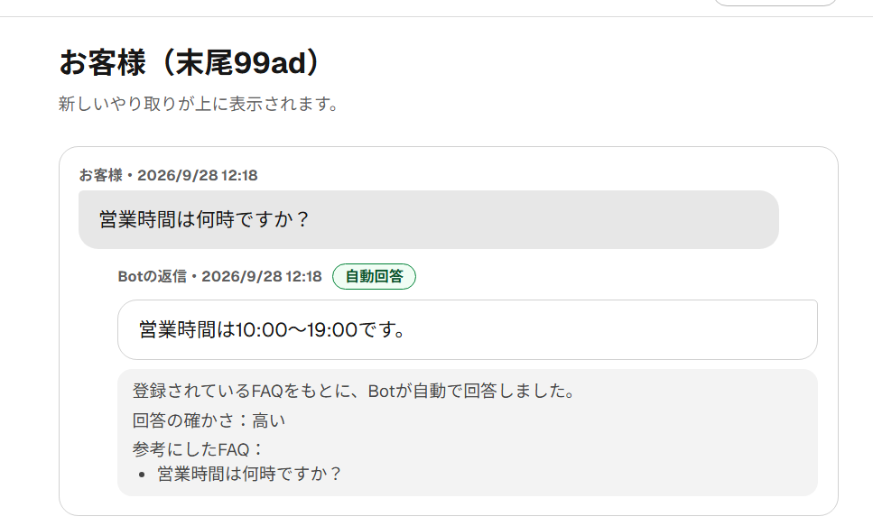
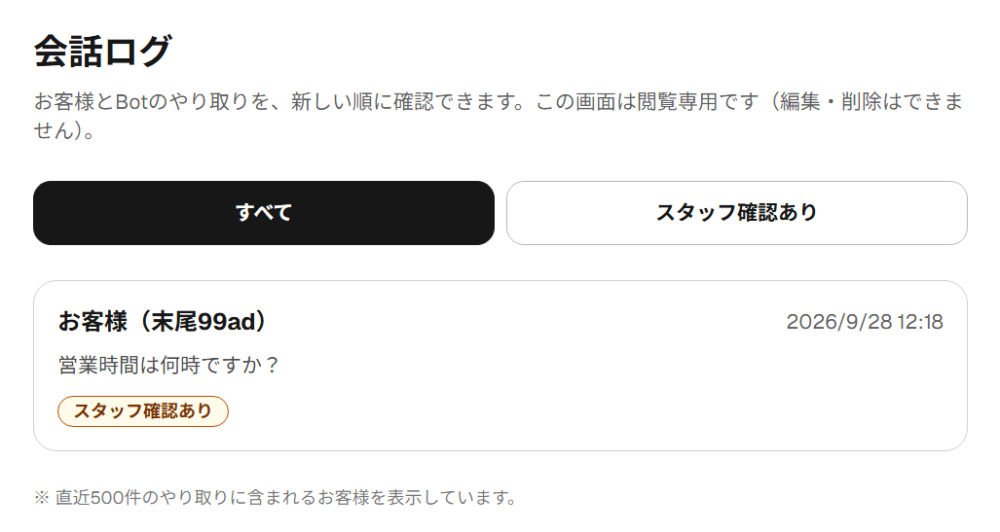
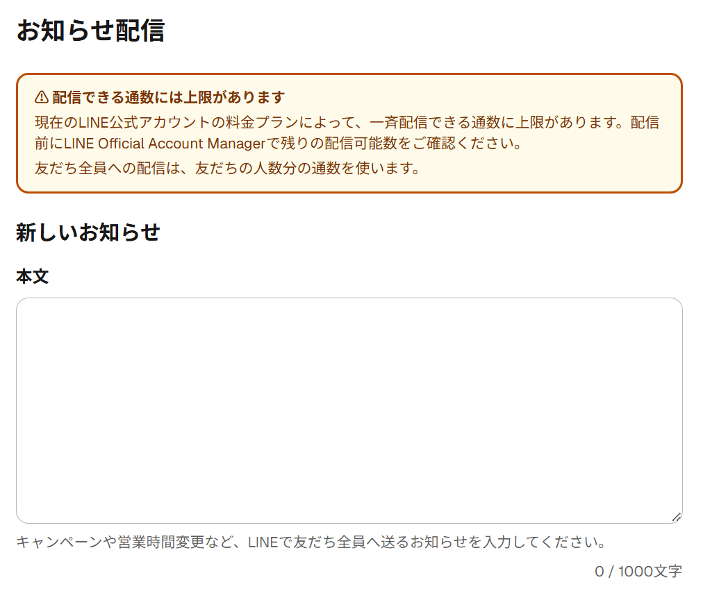
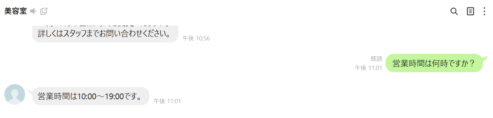

# 美容室向けLINE問い合わせAI Bot

美容室に届く営業時間・設備などの質問へ、登録済みFAQをもとにAIが回答し、スタッフの問い合わせ対応を支援します。

[作品一覧](https://github.com/moedaichi0629-ai/landing-page) · [ポートフォリオ](https://moedaichi0629-ai.github.io/landing-page/)



## 解決する課題

**想定利用者：** 個人経営の美容室・LINEで問い合わせを受ける店舗

繰り返し届く質問への対応と、回答できない質問のスタッフへの引き継ぎ。

## 主な機能

- 登録済みFAQをもとにしたClaudeの自動回答
- 根拠がない・確信度が低い回答をスタッフ確認へ切り替え
- スマートフォン向けFAQ管理・会話ログ・お知らせ配信

## デモ・利用方法

[紹介ページ](https://line-reservation-bot-two.vercel.app/)。管理画面は認証が必要です。

## 使用技術

Next.js / TypeScript / Supabase / Claude API / LINE Messaging API

## 工夫した点

根拠FAQの検証、Webhook署名検証、二重処理・二重配信防止を組み合わせています。

## 現在の実装範囲

予約の受付・空き枠管理を行うBotではありません。メニュー・料金の管理機能はBotの回答には未連携です。

## セットアップ・技術詳細

<details>
<summary>操作方法・構成・設定手順などの詳細を開く</summary>

美容室の LINE 公式アカウントに届く「営業時間は？」「駐車場は？」といった問い合わせに、**オーナーが登録した FAQ をもとに AI（Claude）が自動で返信する** Bot と、スマートフォンで使える管理画面です。
個人経営の美容室オーナー（非エンジニア）向けに、**問い合わせ対応の手間を減らしつつ、AI の誤った回答でお客様に間違った案内をしない**ことを目指しました。
FAQ だけでは確実に答えられない質問には AI の回答を送らず、オーナーの LINE へ通知します。管理画面からは FAQ の編集、会話ログの確認、友だち全員へのお知らせ配信ができます。

## デモ / 公開 URL

- 紹介ページ: https://line-reservation-bot-two.vercel.app
- 管理画面: https://line-reservation-bot-two.vercel.app/admin

管理画面はパスワードで保護されており、第三者はログイン・操作できません（デモ用アカウントは公開していません）。
トップページ（`/`）はポートフォリオ用の紹介ページです。Bot の機能は LINE 公式アカウント側、管理機能は `/admin` にあります。

## スクリーンショット

### 管理画面トップ

FAQ管理・メニュー管理・会話ログ・お知らせ配信を1つの管理画面から操作できます。


### FAQ管理

Botが回答に利用するFAQを、管理画面から追加・編集・公開/非公開にできます。



### 会話ログ

顧客の質問、Botの回答、回答の確かさ、参考にしたFAQを確認できます（お客様は LINE ユーザーIDの末尾4文字のみ表示）。



<details>
<summary>会話ログ一覧</summary>



</details>

### お知らせ配信

お知らせを下書き保存し、管理者へのテスト送信後に友だち全員へ配信する機能を実装しています（配信前に確認ダイアログを表示）。



### LINEでのFAQ回答

LINEからの質問に対して、登録済みFAQをもとに自動回答します。



## 機能

### Phase 1: 基盤構築
- LINE Messaging API 連携（Webhook）
- Webhook 署名検証（HMAC-SHA256）
- 会話ログ記録（Supabase）
- LINE の再送による同じメッセージの二重処理防止

### Phase 2: FAQ 自動回答
- 公開中の FAQ をもとに Claude API が回答
- 確信度（high / medium / low）の判定と、回答の根拠にした FAQ の記録
- 確信度が低い・根拠 FAQ が無い場合は、定型文を返してオーナーへ LINE 通知（Push）

### Phase 3: 管理画面（スマートフォン向け）
- パスワード認証でのログイン
- FAQ 管理（追加・編集・公開/非公開・並び替え・削除。変更は次のメッセージから Bot に反映）
- メニュー・料金管理（追加・編集・公開/非公開・並び替え・削除。**Bot の回答には未連携**）
- 会話ログ閲覧（読み取り専用。お客様は LINE ユーザーIDの末尾4文字のみ表示）
- お知らせ一斉配信（LINE Broadcast API）
  - 下書き保存 → 管理者だけへのテスト送信 → 確認ダイアログを経て友だち全員へ配信
  - 状態管理（下書き / 配信処理中 / 配信済み / 配信失敗）と二重配信防止

## 工夫した点

- **AI の回答をそのまま使わない**: Claude には回答と一緒に確信度（high/medium/low）と根拠 FAQ の ID を構造化出力（Zod スキーマ）で返させ、自己申告のまま信用せずにサーバー側で検証しています。
- **根拠 FAQ を記録・検証**: Claude が挙げた FAQ ID を実在する公開 FAQ と突き合わせ、存在しない ID は除外。「high」と申告しても有効な根拠が0件ならスタッフ確認に回します。根拠 FAQ は会話ログに保存し、管理画面で「参考にしたFAQ」として確認できます。
- **低確信度時はスタッフ確認**: AI が生成した回答文はお客様に送らず、「スタッフが確認します」という定型文を返してオーナーへ通知します。AI の障害・タイムアウト（8秒）時は別のお詫び文を返し、通知はしません。
- **一斉配信の二重配信防止**: 状態の原子的な条件付き UPDATE（下書き/失敗 → 配信処理中）、LINE の `X-Line-Retry-Key`、retry key の有効期限（24時間）より短い23時間の送信期限を組み合わせています。結果が分からなくなった配信は自動再送せず、「状態確認が必要」と表示します。
- **非エンジニア向けの管理画面**: スマートフォン幅を前提にした大きなボタン、専門用語を避けた日本語、削除・一斉配信・最後の公開 FAQ を非公開にする操作の確認ダイアログ、送信中のボタン無効化。
- **秘密情報をサーバー側に限定**: 環境変数はすべてサーバー側だけで参照し（`NEXT_PUBLIC_` は不使用）、`server-only` でクライアントからの import をビルド時に防止。Supabase は RLS 全拒否 + サーバー側のみ service role でアクセスします。ビルド成果物に秘密情報が含まれないことも確認しています。
- **テスト**: Vitest で 593 テスト。LINE・Supabase・Claude をモックし、Webhook の結合テスト、DB の CHECK 制約を再現したフェイクでの配信ロジック検証、「全ページ・全 Server Action が認証を確認しているか」のテストを含みます。

## 技術スタック

| 項目 | 技術 |
|------|------|
| フロントエンド | Next.js 16.3.5（App Router）、React 19.2.8、TypeScript、Tailwind CSS 4 |
| バックエンド | Next.js（Server Components / Server Actions / Route Handler） |
| データベース | Supabase（PostgreSQL、RLS） |
| LINE | LINE Messaging API（`@line/bot-sdk`）: Webhook、Reply、Push、Broadcast |
| AI | Anthropic Claude API（`@anthropic-ai/sdk`、構造化出力） |
| 入力検証 | Zod（サーバー側） |
| 認証 | お客様: ログインなし（LINE Messaging API の Webhook 経由でやり取り）／管理者: パスワード + 署名付き Cookie |
| テスト | Vitest |
| デプロイ | Vercel |

## ディレクトリ構成

```
line-reservation-bot/
├── app/
│   ├── api/line/webhook/route.ts     # LINE Webhook
│   └── admin/                        # 管理画面（/admin）
│       ├── login/                    # ログイン
│       └── (protected)/              # 認証必須エリア
│           ├── faq/                  # FAQ管理
│           ├── menus/                # メニュー・料金
│           ├── conversations/        # 会話ログ
│           └── announcements/        # お知らせ配信
├── components/admin/                 # 管理画面の共通部品
├── lib/
│   ├── line/                         # 署名検証・LINE クライアント・Push・Broadcast・オーナー通知
│   ├── claude/                       # Claude クライアント・プロンプト・出力スキーマ
│   ├── faq/                          # 回答フロー・定型文
│   ├── admin/                        # 認証・リポジトリ・お知らせ配信・入力検証
│   └── supabase/                     # サーバー用クライアント・公開 FAQ 取得
├── types/database.ts                 # DB の型定義
├── supabase/migrations/              # 0001〜0003
├── tests/                            # Vitest
├── docs/                             # ドキュメント
├── proxy.ts                          # /admin の楽観的認証チェック
└── .env.example                      # 環境変数テンプレート（値は空）
```

## セットアップ

手順の詳細は **[docs/setup-guide.md](docs/setup-guide.md)** にあります。概要:

```bash
git clone https://github.com/moedaichi0629-ai/line-reservation-bot.git
cd line-reservation-bot
npm install
cp .env.example .env.local   # 8つの環境変数を設定
npm run dev                  # http://localhost:3000/admin
```

必要な環境変数（値は絶対にコミットしないこと）:

| 変数名 | 用途 |
|--------|------|
| `LINE_CHANNEL_SECRET` | Webhook の署名検証 |
| `LINE_CHANNEL_ACCESS_TOKEN` | 返信・Push・一斉配信 |
| `SUPABASE_URL` | データベースの URL |
| `SUPABASE_SERVICE_ROLE_KEY` | データベースへのアクセス（最重要機密） |
| `ANTHROPIC_API_KEY` | Claude API |
| `OWNER_LINE_USER_ID` | スタッフ確認の通知先・お知らせのテスト送信先 |
| `ADMIN_PASSWORD` | 管理画面のパスワード（12文字以上） |
| `ADMIN_SESSION_SECRET` | ログイン Cookie の署名用（32文字以上） |

Supabase では `supabase/migrations/` の 0001 → 0002 → 0003 を順に実行します。

## npm コマンド

| コマンド | 説明 |
|---------|------|
| `npm run dev` | 開発サーバー起動（Turbopack） |
| `npm run build` | 本番ビルド |
| `npm run start` | 本番ビルドの起動 |
| `npm run lint` | ESLint |
| `npm run type-check` | TypeScript 型チェック |
| `npm run test` | Vitest（37ファイル / 593テスト） |

テストでは LINE・Supabase・Claude はすべてモックで、実際の送信や DB への書き込みは行いません。

## 本番デプロイ

GitHub 連携した Vercel にデプロイしています（`main` への push で本番デプロイ）。
環境変数は **Production のみ**に登録します（Preview に登録すると、プレビュー環境から本番と同じ友だち全員へ配信できてしまうため）。
公開前後の確認項目は **[docs/deploy-checklist.md](docs/deploy-checklist.md)** を参照してください。

## セキュリティ

- **LINE Webhook**: 全リクエストの署名（HMAC-SHA256）を検証し、不一致は `401` で処理しません。サーバーログにはエラー名などの要約だけを出し、質問文やトークンは出しません（会話内容は DB の会話ログにのみ保存）。
- **管理画面**: パスワード（12文字以上）+ HMAC 署名付き Cookie（30日、`/admin` パスのみ、httpOnly）。全ページ・Server Action・データ取得関数で `requireAdmin()` を呼び、テストで強制しています。`proxy.ts` は楽観的チェックのみです。
- **データベース**: 全4テーブルで RLS 有効・ポリシー0件（デフォルト全拒否）。サーバー側だけが `SUPABASE_SERVICE_ROLE_KEY` でアクセスします。
- **環境変数**: `NEXT_PUBLIC_` は使いません。`.env*` は `.gitignore` で除外しています（`.env.example` のみ管理）。
- **個人情報**: 管理画面では LINE ユーザーIDを末尾4文字だけ表示し、URL にも含めません。

## 既知の制約

詳細は [docs/technical-spec.md](docs/technical-spec.md) の「既知の制約」を参照してください。主なもの:

- メニュー・料金は Bot の回答に使われません（Bot に答えさせる内容は FAQ に登録）
- Webhook にお客様ごとの送信回数制限がありません（連投で Claude の利用料と LINE の送信数を消費し得る）
- ログイン試行回数の制限はコードに無く、Vercel Firewall でのレート制限を前提としています
- ログイン状態を個別に無効化できません（`ADMIN_SESSION_SECRET` の変更で全員ログアウト）
- 「状態確認が必要」になったお知らせを画面から復旧できません（SQL で対応）
- お知らせ・会話ログを管理画面から削除できません

## 今後の改善

- **Webhook のレート制限**: お客様ごとの一定時間あたりの処理回数を制限し、Claude の利用料と LINE の送信数を守る
- **ログイン試行回数の制限をアプリ側にも実装**: Vercel のプランに依存しない保護
- **メニュー・料金の Bot 連携**: 料金の質問にメニュー情報から答えられるようにする
- **お知らせ配信の運用機能**: 「状態確認が必要」の復旧操作、下書きの編集・削除を管理画面で行えるようにする
- **環境分離**: 開発用と本番用の Supabase・LINE チャネルを分ける

## ドキュメント

| ドキュメント | 対象 | 内容 |
|---|---|---|
| [docs/operations.md](docs/operations.md) | オーナー様 | 管理画面の使い方・トラブル対応 |
| [docs/setup-guide.md](docs/setup-guide.md) | 開発者 | セットアップ手順 |
| [docs/technical-spec.md](docs/technical-spec.md) | 開発者 | 構成・フロー・DB・セキュリティ・既知の制約 |
| [docs/deploy-checklist.md](docs/deploy-checklist.md) | 開発者 | 本番デプロイ前後のチェックリスト |
| [docs/delivery-checklist.md](docs/delivery-checklist.md) | 開発者 | 納品チェックリスト |
| [docs/retrospective.md](docs/retrospective.md) | 開発者 | 振り返り |

## 開発の進め方

開発方針は [CLAUDE.md](CLAUDE.md) に記載しています。Plan 提示 → 1機能ずつ実装 → テスト → コードレビュー → ドキュメント、の順で進めました。

</details>

