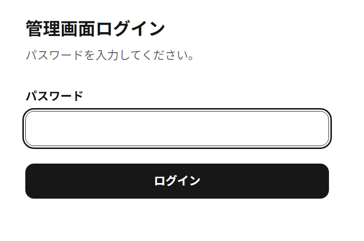
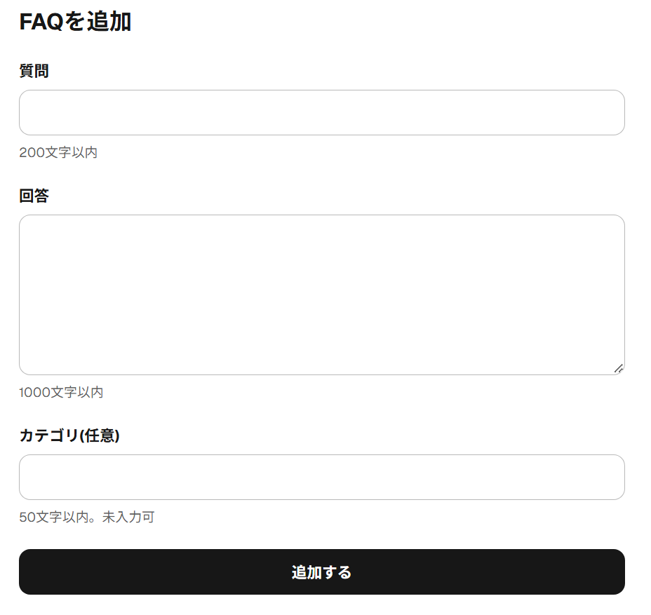
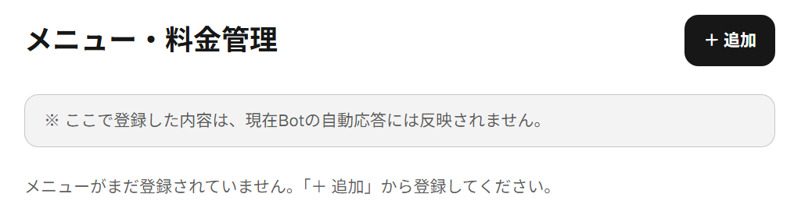
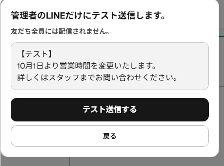
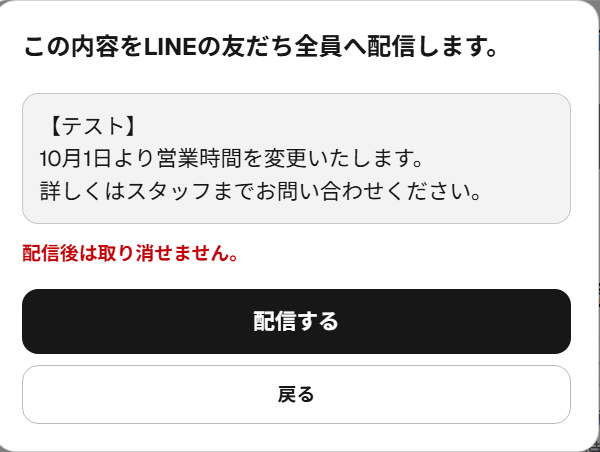

# LINE Bot 運用マニュアル

美容室のオーナー様・スタッフ様向けの使い方ガイドです。
スマートフォンで読みながら操作できるように書いています。

---

## 目次

1. [この Bot でできること](#1-この-bot-でできること)
2. [ログイン・ログアウト](#2-ログインログアウト)
3. [FAQ管理（Bot の回答のもと）](#3-faq管理bot-の回答のもと)
4. [メニュー・料金](#4-メニュー料金)
5. [会話ログ](#5-会話ログ)
6. [お知らせ配信](#6-お知らせ配信)
7. [Bot が変な返事をしたとき](#7-bot-が変な返事をしたとき)
8. [Bot が返事をしないとき](#8-bot-が返事をしないとき)
9. [お知らせが「状態確認が必要」になったとき](#9-お知らせが状態確認が必要になったとき)
10. [よくある質問](#10-よくある質問)
11. [サポート連絡先](#11-サポート連絡先)

---

## 1. この Bot でできること

- お客様が LINE で質問すると、**管理画面に登録した「FAQ（よくある質問）」をもとに** Bot が自動で返事をします。
- FAQ だけでは確実に答えられない質問には、Bot は答えを作りません。
  代わりに「スタッフによる確認が必要です」とお客様へ返し、**オーナー様の LINE に通知**します。
- 管理画面から、LINE の友だち全員へ**お知らせを一斉配信**できます。

*LINE Bot の動作例*

登録済みFAQに回答できる質問の場合、このようにLINEへ自動返信されます。

> Bot は FAQ に書かれていないこと（料金・空き状況など）を推測して答えないように作られています。
> 答えてほしい内容は、FAQ に登録してください。

---

## 2. ログイン・ログアウト

### ログインする

1. スマートフォンのブラウザ（Safari / Chrome など）で次のアドレスを開きます。

   **https://line-reservation-bot-two.vercel.app/admin**

2. 「管理画面ログイン」の画面が出ます。パスワードを入れて「**ログイン**」を押します。
3. 「管理メニュー」が表示されたら完了です。

*管理画面ログイン画面*

- パスワードは技術担当者から、安全な方法で別にお渡しします。人に教えたり、メモを LINE で送ったりしないでください。
- パスワードを間違えると「パスワードが正しくありません。もう一度入力してください。」と表示されます。
- 「ログインできません。しばらくしてからもう一度お試しください。…」と表示されるときは、設定の問題の可能性があります。技術担当者へご連絡ください。

> ブックマーク（ホーム画面に追加）しておくと、次から簡単に開けます。

### 管理メニュー

ログインすると、次の4つのボタンが並んだ画面になります。

| ボタン | できること |
|---|---|
| FAQ管理 | Bot の回答のもとになる「よくある質問」を編集 |
| メニュー・料金 | メニューと料金を記録（※ Bot の回答には使われません） |
| 会話ログ | お客様と Bot のやり取りを見る |
| お知らせ配信 | LINE の友だち全員へお知らせを送る |

*管理画面トップ*

画面上の「**管理画面**」の文字を押すと、いつでもこの画面に戻れます。

### ログアウトする

画面右上の「**ログアウト**」を押します。

- 一度ログインすると **30日間** はログインしたままになります（ブラウザを閉じても続きます）。
- お店の共用端末や、人に貸す端末では、使い終わったら必ずログアウトしてください。
- スマートフォンを紛失したときは、すぐに技術担当者へ連絡してください（全員を強制的にログアウトさせる操作ができます）。

---

## 3. FAQ管理（Bot の回答のもと）

**Bot は「公開中」の FAQ だけを使って返事をします。** ここがいちばん大切な画面です。

### FAQ を見る

「管理メニュー」→「**FAQ管理**」を押すと、登録済みの FAQ が一覧で表示されます。
それぞれに「公開中」または「非公開」の表示が付いています。

*FAQ管理一覧*

### FAQ を追加する

1. 右上の「**＋ 追加**」を押します。
2. 次の項目を入力します。
   - **質問**：お客様が聞きそうなこと（200文字まで）
     例）駐車場はありますか？
   - **回答**：Bot に答えてほしい内容（1000文字まで）
     例）店舗の裏に2台分の駐車場がございます。
   - **カテゴリ（任意）**：自分用の分類（50文字まで）。空でもかまいません。
3. 「**追加する**」を押します。

*FAQ追加画面*

- 追加した FAQ は**すぐに「公開中」になり、Bot の回答に使われます。**
- 新しい FAQ は一覧のいちばん下に追加されます。

### FAQ を編集する

1. 直したい FAQ の「**編集**」を押します。
2. 内容を直して「**保存する**」を押します。

### 公開・非公開を切り替える

- 「**非公開にする**」を押すと、その FAQ は Bot の回答に使われなくなります（削除はされません）。
- 「**公開する**」を押すと、また使われるようになります。

> 「しばらく使わない」「内容が正しいか自信がない」ときは、削除ではなく**非公開**がおすすめです。

**⚠ 公開中の FAQ が 0 件になると：**
Bot はすべての質問に「スタッフによる確認が必要です」と返し、そのたびにオーナー様の LINE へ通知が届きます（LINE の送信できる数を使います）。
最後の1件を非公開・削除しようとすると、確認の画面が出ます。

### 並び替える

各 FAQ の「**↑ 上へ**」「**↓ 下へ**」で1つずつ移動できます。
並び順は管理画面での見やすさのためのものです。

### 削除する

1. 「**削除**」を押します。
2. 確認の画面で「**削除する**」を押します（やめるときは「**キャンセル**」を押します）。

- 削除すると元に戻せません。
- 削除した FAQ は、会話ログの「参考にしたFAQ」に「（削除されたFAQ）」と表示されるようになります。

### 変更はいつ Bot に反映される？

保存・公開・非公開・削除は、**次にお客様から届いたメッセージから**すぐに反映されます。
特別な操作は必要ありません。

---

## 4. メニュー・料金

**⚠ 大切：ここに登録した内容は、今のところ Bot の回答には使われません。**

お客様から「カットはいくらですか？」と聞かれたときに Bot に答えてほしい場合は、
**同じ内容を FAQ にも登録してください。**

この画面は、メニューと料金を管理画面にまとめて記録しておくためのものです。
（「公開する / 非公開にする」の切り替えもありますが、今のところ LINE には何も表示されません。）

*メニュー・料金管理画面*

画面の上にも「※ ここで登録した内容は、現在Botの自動応答には反映されません。」と表示されています。

### 追加する

1. 「管理メニュー」→「**メニュー・料金**」→「**＋ 追加**」を押します。
2. 次の項目を入力します。
   - **メニュー名**（100文字まで）
   - **説明（任意）**（500文字まで）
   - **料金（円）**：半角数字のみ。0〜1,000,000
   - **所要時間（分）**：半角数字のみ。1〜600
3. 「**追加する**」を押します。

### 編集・公開/非公開・並び替え・削除

FAQ と同じ操作です。

- 「**編集**」→ 直して「**保存する**」
- 「**公開する**」/「**非公開にする**」
- 「**↑ 上へ**」/「**↓ 下へ**」
- 「**削除**」→ 確認画面で「**削除する**」（元に戻せません）

---

## 5. 会話ログ

お客様と Bot のやり取りを確認できます。**見るだけの画面で、変更や削除はできません。**

### お客様の一覧を見る

「管理メニュー」→「**会話ログ**」を押すと、最近やり取りしたお客様が新しい順に並びます。

- お客様は「**お客様（末尾1a2b）**」のように、LINE のユーザーIDの**最後の4文字だけ**で表示されます。
  お名前や ID 全体は表示されません（個人情報を守るため）。
- 最後にお客様が送ったメッセージと日時が表示されます。
- 直近のやり取りの中にスタッフ確認があったお客様には「**スタッフ確認あり**」の印が付きます。
- 一覧には、直近500件のやり取りに含まれるお客様が表示されます。

*会話ログ一覧*

### 誰が何を質問したか・Bot がどう答えたかを見る

一覧のお客様を押すと、そのお客様とのやり取りが**新しい順**に表示されます。

*会話ログ詳細*

この画面では、次のことが確認できます。

- **お客様の質問**：灰色の吹き出し（例：「営業時間は何時ですか？」）
- **Bot の返信**：白い吹き出しと、その横の表示（例：「自動回答」）
- **回答の確かさ**：Bot がどれくらい自信を持って答えたか（例：「高い」）
- **参考にしたFAQ**：Bot が回答のもとにした FAQ の質問文

Bot の返事には、次のような表示が付きます。

| 表示 | 意味 |
|---|---|
| 自動回答 | FAQ をもとに Bot が答えました |
| スタッフ確認が必要 | Bot では確実に答えられないと判断し、「スタッフによる確認が必要です」という決まった文を返しました。オーナー様への通知の対象です |
| 自動応答エラー | システムの一時的な不具合で、お詫びの定型文を返しました |
| 定型メッセージ | 画像・スタンプなど、文字以外のメッセージへの決まった返事です |

- **回答の確かさ**：高い / ふつう / 低い（Bot 自身の判断です）
- **参考にしたFAQ**：Bot が回答のもとにした FAQ の質問文

古いやり取りは、画面下の「**さらに前のやり取りを見る**」で表示できます。

### スタッフ確認が必要だった会話だけを見る

会話ログ画面の上にある「**スタッフ確認あり**」を押すと、スタッフ確認になったやり取りがあるお客様だけに絞り込めます。
「**すべて**」を押すと元に戻ります。

> 会話ログにはお客様の個人情報が含まれます。画面の写真を SNS に載せたり、外部に共有したりしないでください。

---

## 6. お知らせ配信

LINE の友だち全員へ、文字のお知らせを1通送れます（画像は送れません）。

### ⚠ 必ずお読みください：配信できる数には上限があります

- LINE 公式アカウントは、料金プランごとに**1か月に送れるメッセージの数**が決まっています。
- **友だち全員への配信は、友だちの人数分の数を使います。**
  例）友だちが100人なら、1回の配信で100通分を使います。
- 「自分にテスト送信」も1通分を使います。
- スタッフ確認のオーナー様への通知も、1回につき1通分を使います。
- 上限に達すると、その月は配信やオーナー様への通知ができなくなります。

**配信の前に、LINE Official Account Manager（LINE 公式アカウントの管理画面）で残りの数を確認してください。**

### 手順1：下書きを作る

1. 「管理メニュー」→「**お知らせ配信**」を押します。
2. 画面の「新しいお知らせ」の下にある「本文」欄に文章を入力します（1000文字まで。右下に文字数が出ます）。
3. 「**下書きを保存**」を押します。

*お知らせ配信画面*

- **保存しただけでは LINE には送られません。**
- 保存したお知らせは、下の「配信履歴」に「**下書き**」として表示されます。
- 下書きは管理画面から**編集・削除できません**。直したいときは、新しく作り直してください。

### 手順2：自分にテスト送信する（おすすめ）

1. 配信履歴のお知らせにある「**自分にテスト送信**」を押します。
2. 「管理者のLINEだけにテスト送信します。」という確認画面が出ます。本文を確認して「**テスト送信する**」を押します。
3. オーナー様の LINE に届いた内容を確認します。

- 友だち全員には送られません。
- テスト送信の後も、状態は「**下書き**」のままです。

*管理者のLINEだけに送るテスト送信確認画面*

確認画面にも「友だち全員には配信されません。」と表示されます。**テスト送信は、オーナー様（管理者）の LINE だけに届きます。**

### 手順3：友だち全員へ配信する

1. 配信履歴のお知らせにある「**友だち全員へ配信する**」を押します。
2. 「この内容をLINEの友だち全員へ配信します。」という確認画面が出ます。
   **本文をよく読み、「配信後は取り消せません。」を確認してください。**
3. 問題なければ「**配信する**」を押します。やめるときは「**戻る**」を押します（何も送られません）。
4. 「お知らせを配信しました。」と表示され、状態が「**配信済み**」になれば完了です。

*友だち全員への配信確認画面*

この画面では、次の順番で確認してください。

1. 枠の中の**配信内容**を最後まで読み、誤字・日付・金額に間違いがないか確認する
2. 赤い文字の「**配信後は取り消せません。**」を確認する
3. **内容が正しい場合のみ**「配信する」を押す。少しでも迷ったら「戻る」を押す

> **⚠ 「配信する」は不用意に押さないでください。**
> 押した時点で友だち全員に届き、**取り消せません**。友だちの人数分の送信数も使います。
> 誤字や日付の間違いがないか、先にテスト送信で必ず確認してください。

### 配信できる期限

お知らせは、**作成してから23時間以内**しか配信できません（二重配信を防ぐための決まりです）。
期限を過ぎると「**送信期限切れ**」と表示されます。その場合は、新しくお知らせを作り直してください。

### 状態の見かた

| 状態 | 意味 | どうすればいい？ |
|---|---|---|
| **下書き** | まだ友だち全員には送っていません | テスト送信 → 配信 |
| **配信処理中** | LINE へ送っている途中です | 少し待って画面を読み込み直してください |
| **配信済み** | LINE が配信を受け付けました | 何もしなくて大丈夫です |
| **配信失敗** | 送れませんでした。理由が表示されます | 理由を確認し、「**もう一度配信する**」を押せます（作成から23時間以内） |
| **状態確認が必要** | 「配信処理中」のまま10分以上たっています | **自分で再送しないでください。** [9章](#9-お知らせが状態確認が必要になったとき)へ |
| **送信期限切れ / 再送期限切れ** | 作成から23時間を過ぎました | 新しくお知らせを作り直してください |

- 「もう一度配信する」は、前回と同じ配信として送り直します。前回の配信が実は LINE に届いていた場合、二重には配信されません。
- 配信履歴には新しい順に50件まで表示されます。

---

## 7. Bot が変な返事をしたとき

次の順番で確認・対応してください。

1. **会話ログを確認する**
   そのお客様の会話を開き、Bot の返事と「参考にしたFAQ」を確認します。
2. **FAQ に答えがあるか確認する**
   FAQ管理で、その質問に合う FAQ が「公開中」になっているか確認します。
3. **FAQ が無ければ追加する**
   お客様の質問に合う FAQ を「＋ 追加」で登録します。
4. **FAQ の回答を直す**
   「参考にしたFAQ」の内容が古い・間違っている場合は、その FAQ を「編集」で直します。
   Bot は FAQ の回答文をもとに答えるので、**回答文をはっきり具体的に書く**と正確になります。
5. **必要なら一時的に非公開にする**
   すぐに直せない FAQ は「非公開にする」で Bot が使わないようにします。
   （公開中の FAQ が0件にならないよう注意してください）

- 間違った案内をしてしまったお客様には、お店から直接ご連絡ください。
- 同じ問題がくり返し起きる場合は、会話の日時とお客様の表示（末尾4文字）を控えて、技術担当者へご連絡ください。

---

## 8. Bot が返事をしないとき

上から順番に確認してください。
わからない項目は、無理に操作せず技術担当者へ連絡してください。

### まずお店でできる確認

1. **お客様側の状況**
   - お客様が LINE 公式アカウントを友だち追加しているか（ブロックされていないか）
   - 画像・スタンプには「テキストメッセージのみ対応しています。」とだけ返します（故障ではありません）
2. **会話ログを見る**
   - **お客様のメッセージが会話ログに無い** → メッセージがシステムに届いていません。3・4 を確認し、技術担当者へ連絡してください。
   - **お客様のメッセージはあるが、Bot の返事が「自動応答エラー」** → AI の一時的な不具合です。しばらくしても続く場合は技術担当者へ。
   - **「スタッフ確認が必要」になっている** → 故障ではありません。お客様へ直接ご対応ください。
3. **LINE 公式アカウントの設定**（LINE Official Account Manager）
   - 応答の設定で「Webhook」が**オン**、「応答メッセージ」が**オフ**になっているか
   - 今月の送信できる数が残っているか（オーナー様への通知やお知らせ配信に影響します）
4. **管理画面が開けるか**
   - 管理画面も開けない場合は、システム全体が止まっている可能性があります。技術担当者へ連絡してください。

### 技術担当者が確認すること（参考）

連絡を受けた技術担当者は、次の順番で確認します。

| 順番 | 確認先 | 主な確認内容 |
|---|---|---|
| 1 | LINE Developers | Webhook の URL・「Webhookの利用」・「検証」ボタンの結果 |
| 2 | Vercel | 最新のデプロイが成功しているか、エラーの記録（Logs） |
| 3 | Supabase | プロジェクトが止まっていないか |
| 4 | Anthropic | API キーが有効か、利用残高・上限に余裕があるか |
| 5 | 環境変数 | Vercel の設定値（8個）が正しく登録されているか |

---

## 9. お知らせが「状態確認が必要」になったとき

配信の途中で通信が切れるなどして、**配信できたかどうかシステムで確認できなくなった**状態です。

**このとき、Bot は自動で再送しません。あなたも再送しないでください。**
すでに友だち全員に届いている場合、もう一度送ると**二重に配信**されてしまうためです。

### 手順

1. **LINE 側で配信されたか確認する**
   LINE Official Account Manager を開き、メッセージの配信履歴に、そのお知らせが送られているか確認します。
2. **自分で作り直して送らない**
   同じ内容で新しいお知らせを作って配信すると、二重配信になるおそれがあります。
3. **技術担当者へ連絡する**
   次の内容を伝えてください。
   - 配信履歴に表示されている「作成日時」と、本文の最初の部分
   - LINE Official Account Manager で見て、配信されていたかどうか

技術担当者が、配信履歴の状態を「配信済み」または「配信失敗」に直します。
（「配信失敗」に直した場合で、作成から23時間以内なら「もう一度配信する」が使えます）

---

## 10. よくある質問

**Q. FAQ を直したら、すぐ Bot に反映されますか？**
A. はい。次にお客様から届いたメッセージから反映されます。

**Q. 「スタッフ確認が必要」の通知が届いたら、どうすればいいですか？**
A. 通知には、お客様の質問と Bot が確認を求めた理由が書かれています。お客様へはお店から直接ご対応ください。
よく聞かれる内容なら、FAQ に追加すると次から Bot が答えられるようになります。

**Q. お知らせや会話ログを削除できますか？**
A. 管理画面からはできません。必要な場合は技術担当者へご相談ください。

**Q. パスワードを変えたいです。**
A. 管理画面には変更機能がありません。技術担当者へご依頼ください。

**Q. お知らせに画像を付けられますか？**
A. 今は文字だけです。

---

## 11. サポート連絡先

困ったとき、わからないときは、無理に操作せず下記へご連絡ください。

### サポート連絡先

- 担当者名：
- 連絡方法：
- 対応時間：
- 緊急時の連絡方法：

> **API キー・パスワードなどの秘密情報は、問い合わせ時に送らないでください。**

### 連絡するときに伝えてほしいこと

- いつ起きたか（日時）
- どの画面で、何をしたか
- 画面に出たメッセージ（そのまま書き写すか、画面の写真）
- 会話ログの場合は、お客様の表示（例：お客様（末尾1a2b））

> パスワードやお客様の個人情報は、メールや LINE に書かないでください。
