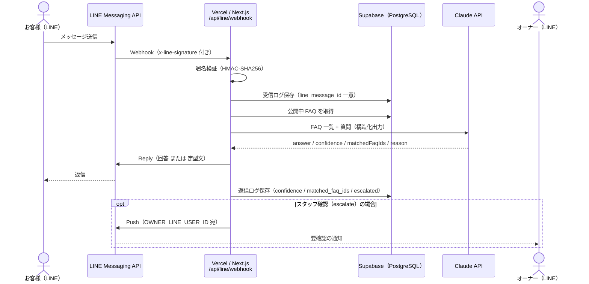
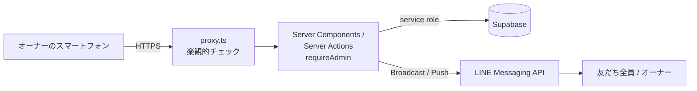
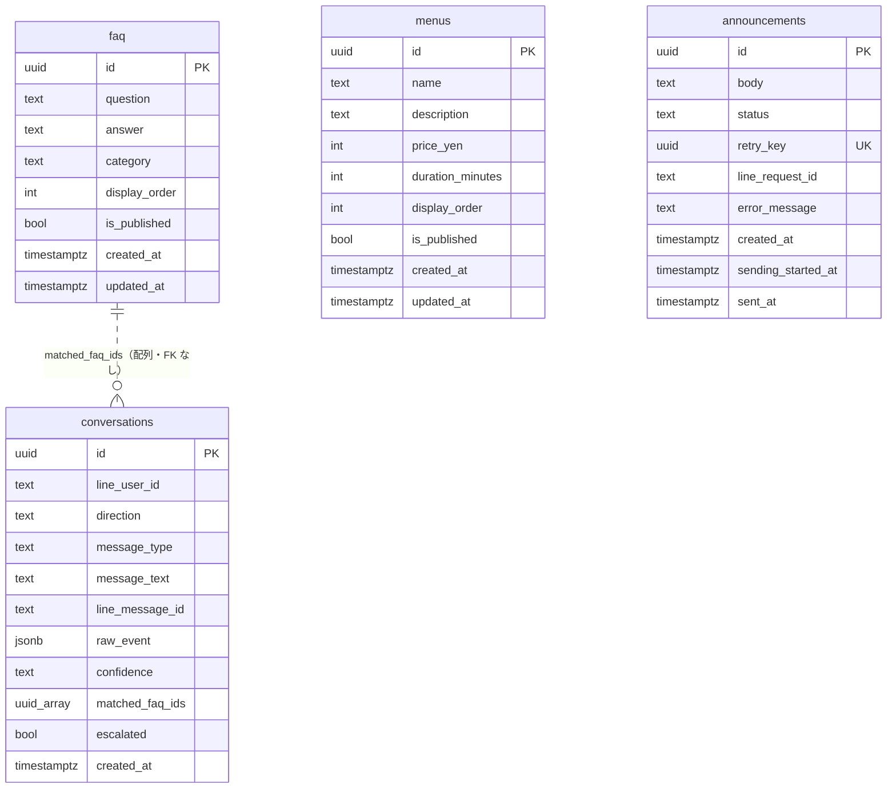
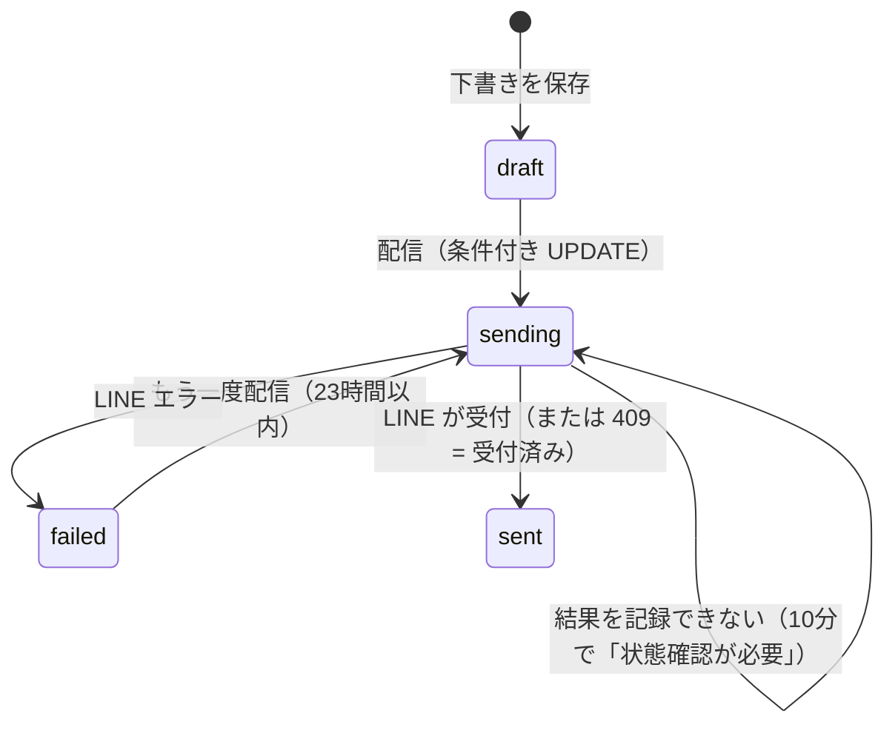

# 技術仕様書（引き継ぎ用）

開発者向けの仕様・設計の説明です。セットアップ手順は [setup-guide.md](setup-guide.md) を参照してください。
記載内容は現在のコードを基準にしています。コードと食い違う場合は**コードが正**です。

---

## 1. システム概要

美容室向けの LINE 問い合わせ Bot と、そのスマートフォン向け管理画面です。

- お客様が LINE 公式アカウントへ送った質問に、管理画面で登録した FAQ をもとに Claude が回答する
- 回答の確信度が低い・根拠となる FAQ が無い場合は、AI の回答を送らずに定型文を返し、オーナーへ LINE で通知する
- 管理画面で FAQ・メニュー・料金の編集、会話ログの閲覧、友だち全員へのお知らせ配信を行う

---

## 2. システム構成

### お客様からの問い合わせ



### 管理画面



---

## 3. 使用技術

`package.json` の依存関係にあるものだけを記載しています。

| 分類 | 技術 | バージョン |
|---|---|---|
| フレームワーク | Next.js（App Router、Server Components、Server Actions、Turbopack） | 16.3.5 |
| UI | React / React DOM | 19.2.8 |
| 言語 | TypeScript | ^5 |
| スタイル | Tailwind CSS（`@tailwindcss/postcss`） | ^4 |
| LINE | `@line/bot-sdk`（Messaging API） | ^11.2.0 |
| DB | `@supabase/supabase-js`（Supabase / PostgreSQL） | ^2.116.0 |
| AI | `@anthropic-ai/sdk`（Claude API、モデル `claude-sonnet-5`） | ^0.126.0 |
| 入力検証 | Zod（サーバー側のみ） | ^4.6.5 |
| サーバー専用ガード | `server-only` | ^0.0.1 |
| テスト | Vitest | ^5.0.0 |
| Lint | ESLint 9 + `eslint-config-next` | — |
| ホスティング | Vercel | — |
| 実行環境 | Node.js | >=22 |

---

## 4. ディレクトリ構成（主要部分）

```
app/
  api/line/webhook/route.ts        LINE Webhook
  admin/login/                     ログイン画面・ログイン/ログアウト Action
  admin/(protected)/               認証必須エリア（layout で requireAdmin）
    faq/ menus/ conversations/ announcements/
  page.tsx                         紹介ページ（静的。認証不要）
lib/
  line/        署名検証・LINE クライアント・Push・Broadcast・オーナー通知
  claude/      Claude クライアント・プロンプト・出力スキーマ
  faq/         回答オーケストレーション・定型文
  supabase/    サーバー用クライアント・公開 FAQ 取得
  admin/       認証・リポジトリ・お知らせ配信・入力検証
components/admin/                  管理画面の共通部品
proxy.ts                           /admin の楽観的認証チェック
next.config.ts                     /admin のセキュリティヘッダー
supabase/migrations/               0001〜0003
tests/                             Vitest（37ファイル / 593テスト）
```

---

## 5. LINE Webhook

**エンドポイント:** `POST /api/line/webhook`（`app/api/line/webhook/route.ts`）

### 処理の流れ

1. `LINE_CHANNEL_SECRET` 未設定 → `500`
2. 生のリクエストボディを `text()` で取得し、`x-line-signature` を HMAC-SHA256 で検証（`lib/line/verify-signature.ts`）。不一致・ヘッダーなし → `401`
3. JSON として解析できない → `400`
4. 署名検証を通過した後は、処理中にエラーが起きても **`200` を返す**（LINE の再送による二重処理を避けるため）
5. `events` を `Promise.allSettled` で処理し、すべて終わってから `200` を返す

### イベント処理

- `message` 以外のイベント（follow 等）は無視
- `replyToken` が無い場合は無視
- テキスト以外（画像・スタンプ等） → 「テキストメッセージのみ対応しています。」を返信（Claude は呼ばない）
- テキスト → 6章の FAQ 回答フロー

### 重複イベント対策

- 受信メッセージを `conversations` に `line_message_id` 付きで保存する。`line_message_id` には部分一意インデックスがある
- 再送された同じメッセージは一意制約違反（`23505`）となり、「処理済み」として何もしない（Claude 呼び出し・オーナー通知の二重実行を防ぐ）
- 応答処理が途中で失敗した場合は、受信ログを削除して LINE の再送を受け付けられるようにする
- 受信ログの保存自体が DB 障害で失敗した場合は、返信処理は止めない

### ログ

- 生のエラーオブジェクトや Webhook ボディはログに出さない（エラー名・形状の要約のみ）。トークンや顧客データの混入を防ぐため

---

## 6. FAQ 回答フロー

`lib/faq/answer-user-question.ts` → `lib/claude/generate-faq-answer.ts`

1. **公開 FAQ 取得**（`lib/supabase/faq.ts`、`is_published = true`、`display_order` 順）
   - 取得失敗 → `fallback-error`
   - **0件 → Claude を呼ばずに `escalate`**
2. **Claude 呼び出し**（1回のみ）
   - モデル `claude-sonnet-5`、`max_tokens: 1024`、`effort: "low"`
   - タイムアウト 8 秒、再試行なし（`maxRetries: 0`）
   - Zod スキーマ（`lib/claude/faq-answer-schema.ts`）による構造化出力: `answer` / `confidence`（`high` / `medium` / `low`）/ `matchedFaqIds` / `reason`
   - プロンプトインジェクション対策: FAQ は `[FAQ_LIST]`、質問は `[USER_MESSAGE]` で囲み、質問文中の同名タグは除去する（`lib/claude/prompt.ts`）
   - API エラー・タイムアウト・出力解析失敗 → `fallback-error`
3. **ガードレール**（Claude の自己申告をそのまま信用しない）
   - `matchedFaqIds` は実際に取得した公開 FAQ の ID と突き合わせ、存在しない ID は除外
   - `confidence = low` → `escalate`
   - `high` / `medium` でも、有効な `matchedFaqIds` が0件 → `escalate`（強制ダウングレード）
   - それ以外 → `answer`

### 結果ごとの動作

| 結果 | お客様への返信 | `conversations`（返信行） | オーナー通知 |
|---|---|---|---|
| `answer` | Claude の回答（LINE の文字数上限で切り詰め） | `confidence` = high/medium、`matched_faq_ids`、`escalated = false` | なし |
| `escalate` | 定型文「…スタッフによる確認が必要です。…」（**Claude の回答は送らない**） | `confidence = low`、`escalated = true` | Push あり |
| `fallback-error` | 定型文「申し訳ございません。現在、自動応答をご利用いただけません。…」 | `confidence = null` | なし |

### オーナー通知（`lib/line/escalate-to-owner.ts`）

- `OWNER_LINE_USER_ID` 宛に Push。本文は「【要確認の問い合わせ】」+ 質問（500文字まで）+ 理由（200文字まで）+ お客様の LINE ユーザーID
- 通知の失敗・未設定でも例外にしない（お客様への返信は済んでいる）
- `escalated = true` は「通知経路を選んだ」ことを表し、Push が届いたことは表さない
- Push は LINE の月間送信数を消費する

---

## 7. 管理画面認証

| 項目 | 内容 |
|---|---|
| パスワード | `ADMIN_PASSWORD`（12文字以上でないと誰もログインできない）。入力は200文字まで。SHA-256 ダイジェスト同士を `timingSafeEqual` で比較 |
| 失敗時 | 0.8秒待ってからエラーを返す（回数制限はコードに無い） |
| セッション | Cookie `admin_session` = `有効期限.署名`。署名は `ADMIN_SESSION_SECRET`（32文字以上）による HMAC-SHA256 |
| Cookie 属性 | `httpOnly`、`secure`（本番）、`sameSite=lax`、`path=/admin`、30日 |
| ログアウト | Cookie を削除 |
| 全員ログアウト | `ADMIN_SESSION_SECRET` を変更して再デプロイ（パスワード変更では既存セッションは無効にならない） |

### 保護の仕組み

- `proxy.ts`: `/admin` 以下で Cookie を検証する**楽観的チェックのみ**。未認証の GET はログイン画面へリダイレクト、その他のメソッドは `401`
  - Server Action は URL ではなく Action ID で呼ばれるため、proxy は Server Action の保護にならない
- **実際の保護は `lib/admin/auth.ts` の `requireAdmin()`**。すべてのページ・Server Action・データ取得関数（リポジトリ）で呼ぶ
  - Server Action は `tests/app/admin/server-actions-auth.test.ts`、全ページは `tests/app/admin/announcements/security.test.ts` がテストで強制している
- `next.config.ts` で `/admin` 以下に `Cache-Control: no-store`、`X-Frame-Options: DENY`、`frame-ancestors 'none'`、`X-Content-Type-Options: nosniff`、`Referrer-Policy: no-referrer`、`X-Robots-Tag: noindex, nofollow` を付与

---

## 8. DB 設計

全テーブル `public` スキーマ、RLS 有効・ポリシー0件。



### faq（0001）

Bot の回答のもとになる FAQ。

- `question` / `answer` / `category`（任意）
- `is_published`（既定 `true`）: `true` のものだけが Claude に渡される
- `display_order`: 並び順。新規は末尾に追加
- `updated_at` はトリガーで自動更新
- 管理画面での入力上限: 質問200 / 回答1000 / カテゴリ50文字（アプリ側で検証）

### menus（0001）

メニュー・料金の記録。**Bot は参照しない。**

- `name` / `description`（任意）/ `price_yen`（`>= 0`）/ `duration_minutes`（`> 0`）/ `is_published` / `display_order`
- 管理画面での入力上限: 名前100 / 説明500文字、料金 0〜1,000,000円、所要時間 1〜600分

### conversations（0001 + 0002）

LINE とのやり取りのログ（受信・返信の各1行）。

- `line_user_id`: お客様の LINE ユーザーID（個人情報）
- `direction`: `inbound`（お客様→Bot）/ `outbound`（Bot→お客様）
- `message_type` / `message_text`（テキスト以外は本文なし）
- `line_message_id`: 受信メッセージの ID。部分一意インデックス（`not null` の行のみ）で重複処理を防ぐ
- `raw_event`: 受信イベントの JSON（受信行のみ）。管理画面では取得しない
- `confidence` / `matched_faq_ids` / `escalated`（0002 で追加）: 返信行に AI 判定結果を記録

### announcements（0003）

お知らせ配信の履歴。宛先（個人情報）は保存しない。

- `body`: 本文。DB 側 CHECK は「空白のみ不可・5000文字以下」、アプリ側の上限は1000文字
- `status`: `draft` / `sending` / `sent` / `failed`
- `retry_key`: LINE の `X-Line-Retry-Key` に渡す UUID（一意）
- `line_request_id`（100文字以下）/ `error_message`（500文字以下、日本語の要約のみ。アプリ側で切り詰めてから保存）
- `sending_started_at` / `sent_at`: 状態との整合性を CHECK 制約で保証（`draft` は両方 null、`sending` / `failed` は開始日時のみ、`sent` は両方あり）

---

## 9. お知らせ配信

関連ファイル: `lib/admin/send-announcement.ts`、`lib/admin/announcement-repository.ts`、`lib/admin/announcement-policy.ts`、`lib/line/broadcast.ts`、`lib/admin/send-test-announcement.ts`

### 状態遷移



### 本配信の手順（`sendAnnouncement`）

1. `requireAdmin()`、ID 形式・存在・状態・送信可能期間・本文を事前チェック
2. **原子的な条件付き UPDATE** で `sending` に遷移（排他の本体）
   ```
   UPDATE announcements SET status='sending', sending_started_at=now(), error_message=null
   WHERE id=$1 AND status IN ('draft','failed') AND created_at >= now() - 23h
   ```
   0件更新なら「他の処理が先に配信した」として中止（連打・複数タブでの二重配信を防ぐ）
3. LINE **Broadcast API**（`broadcastWithHttpInfo`）をテキスト1通・`retry_key` 付きで呼ぶ
4. 成功 → `sent`（`WHERE status='sending'`）。**409（同じ retry key が受付済み）も成功扱い**で、新たな配信はされない
5. 失敗 → `failed` と日本語のエラー要約を保存
6. 結果の記録自体に失敗した場合は `sending` のまま残し、画面に警告を出す（再送させない）

さらに、確認ダイアログのフォームだけが持つ `confirmation` 値をサーバー側で検証し、確認を経ない送信を拒否します。

### 二重配信防止のまとめ

| 仕組み | 防ぐもの |
|---|---|
| 条件付き UPDATE（draft/failed → sending） | 同時押し・複数タブ・連打 |
| `X-Line-Retry-Key`（LINE 側で24時間有効） | 通信断などで結果不明になった後の再送 |
| 送信可能期間 = 作成から **23時間**（24時間より1時間短い） | retry key 失効後の再送による二重配信 |
| `sending` のまま自動再送しない | 結果不明の配信の再送 |

### テスト送信（オーナーのみ）

- `pushLineMessage` で `OWNER_LINE_USER_ID` 宛にだけ送る。宛先をブラウザから指定する経路は無い
- `announcements` は読むだけで更新しない（状態・`retry_key` は変わらない）
- 本配信できる状態（送信可能期間内の `draft` / `failed`）のときだけ許可
- LINE の送信数を1通消費する

### stale sending（「状態確認が必要」）

- `STALE_SENDING_THRESHOLD_MS = 10分`。`sending` のまま10分以上経過すると画面に警告を出す
- 管理画面の Server Action は `maxDuration = 60`（秒）で打ち切られる。この値は `app/admin/(protected)/layout.tsx` と `app/admin/(protected)/announcements/page.tsx` に数値リテラルで書かれ、閾値との整合はテストで検証している
- 自動再送・画面からの復旧操作は無い。LINE Official Account Manager で配信有無を確認し、SQL Editor で状態を直す

```sql
-- 対象の確認
select id, created_at, sending_started_at, left(body, 30) as body_head
from public.announcements where status = 'sending' order by created_at desc;

-- 配信されていた場合
update public.announcements set status = 'sent', sent_at = now(), error_message = null
where id = '<id>' and status = 'sending';

-- 配信されていなかった場合（作成から23時間以内なら画面から再送できる）
update public.announcements set status = 'failed', error_message = '手動で失敗に戻しました（配信されていないことを確認済み）'
where id = '<id>' and status = 'sending';
```

### 下書きの入力保持

Server Action の `redirect()` でページの部品が作り直されるため、入力途中の本文は `app/admin/(protected)/announcements/draft-store.ts`（`useSyncExternalStore` のモジュールストア）に保持しています。下書き保存成功時（`?saved=`）だけ入力欄を空にします。

---

## 10. 会話ログ（管理画面）

`lib/admin/conversation-repository.ts`

- 一覧: 直近500行を取得してお客様ごとにまとめる。「スタッフ確認あり」は `escalated = true` の直近200行から対象のお客様を抽出
- 詳細: URL のキーは `conversations` の行 UUID。サーバー側で `line_user_id` を引くため、**LINE ユーザーID 全体は URL・画面・クライアントに出ない**
- 表示名は「お客様（末尾xxxx）」（`lib/admin/conversation-labels.ts`）。8文字未満の ID は「お客様（ID不明）」
- 受信と返信を組にして新しい順に表示。50行ずつ、`created_at` のカーソルでページング
- `raw_event` は取得しない

---

## 11. セキュリティ

| 項目 | 実装 |
|---|---|
| LINE 署名検証 | 全 Webhook リクエストで HMAC-SHA256 を検証。失敗は `401` で処理しない |
| service role キー | `lib/supabase/server.ts` のみで使用。`server-only` により Client Component から import するとビルドエラー |
| 秘密情報 | 8つの環境変数はすべてサーバー側のみで参照。`NEXT_PUBLIC_` の変数は使わない |
| クライアントバンドル | Client Component は `lib/admin/schemas.ts`（Zod）を import しない。上限値は `lib/admin/input-limits.ts` から参照 |
| RLS | 全4テーブルで有効、ポリシー0件（anon / authenticated は全拒否） |
| 管理画面 | 全ページ・Server Action・データ関数で `requireAdmin()`。セキュリティヘッダーと `noindex` |
| LINE ユーザーID | 管理画面では末尾4文字のみ。オーナーへの通知 Push には全体が含まれる |
| ログ | エラー名や分類値のみを出力し、トークン・質問全文・生のイベントは出さない |
| 入力検証 | サーバー側で Zod 検証（長さ・空白のみ・制御文字・数値範囲・UUID 形式） |

---

## 12. 既知の制約

コード上で確認できるものだけを記載しています。

| 制約 | 内容 | 影響・対処 |
|---|---|---|
| メニューは Bot 未連携 | `menus` は Claude に渡されない | 料金を Bot に答えさせるには FAQ にも登録する |
| Webhook の顧客別レート制限なし | 連投のたびに Claude を呼び、低確信度ならオーナー Push を送る | Claude の利用料と LINE の送信数を消費し得る。利用状況を定期確認 |
| ログイン試行回数の制限なし | コードは失敗時0.8秒の遅延のみ | Vercel Firewall のレート制限を前提（[deploy-checklist.md](deploy-checklist.md) 4-4）＋長いランダムパスワード |
| セッションの個別無効化なし | サーバー側にセッション一覧を持たない | `ADMIN_SESSION_SECRET` の変更で全員ログアウトのみ |
| `sending` の復旧 UI なし | 「状態確認が必要」は SQL で手動対応 | 9章の SQL を参照 |
| FAQ / メニュー並び替えの部分失敗 | 隣との `display_order` 入れ替えが2回の個別 UPDATE（トランザクションではない） | 途中失敗で順序が重複し得る。管理者1名の想定で許容 |
| FAQ / メニュー新規追加の順序競合 | 末尾の番号を読んでから挿入 | 同時追加で順序が重複し得る（同上） |
| 会話ログ一覧の件数制限 | 一覧は直近500行、「スタッフ確認あり」は直近200行が対象 | 古いお客様は一覧に出ない |
| 会話ログのページ境界 | カーソルが `created_at` のみ | 完全に同一時刻の行がページ境界にあると1行飛ばし得る |
| Webhook の並行再送 | LINE がタイムアウトで再送した時、1回目の処理中に届いた再送は「処理済み」扱いになる | 1回目が失敗すると、そのメッセージには返信されない（Phase 2 で許容済み） |
| お知らせ・会話ログの削除 UI なし | 管理画面から削除できない | 必要なら SQL Editor で個別に削除 |
| お知らせはテキスト1通のみ | 画像等は非対応。下書きの編集も不可 | 作り直す |
| 配信可能数の表示なし | LINE の利用状況 API は未使用 | LINE Official Account Manager で確認 |
| URL クエリの完了メッセージ | `?success=` 等をそのまま表示（テキストのみ） | 細工した URL で任意の文言を表示させられる（XSS ではない） |

---

## 13. テスト

- Vitest、37ファイル / 593テスト（`npm run test`）
- LINE・Supabase・Claude はすべてモック。実際の送信・DB 書き込みは行わない
- 主なテスト
  - `tests/integration/phase2-flow.test.ts`: Webhook ハンドラーを実際に呼ぶ結合テスト（外部 I/O のみモック）
  - `tests/app/admin/server-actions-auth.test.ts`: 全 Server Action が `requireAdmin()` を呼んでいるか
  - `tests/app/admin/announcements/security.test.ts`: お知らせ配信のセキュリティと、管理画面の全ページが `requireAdmin()` を呼んでいるか
  - `tests/lib/admin/fake-announcements-db.ts`: 0003 の CHECK 制約を再現したインメモリ DB で配信ロジックを検証
  - `tests/supabase/migrations.test.ts`: マイグレーション SQL の静的検証
